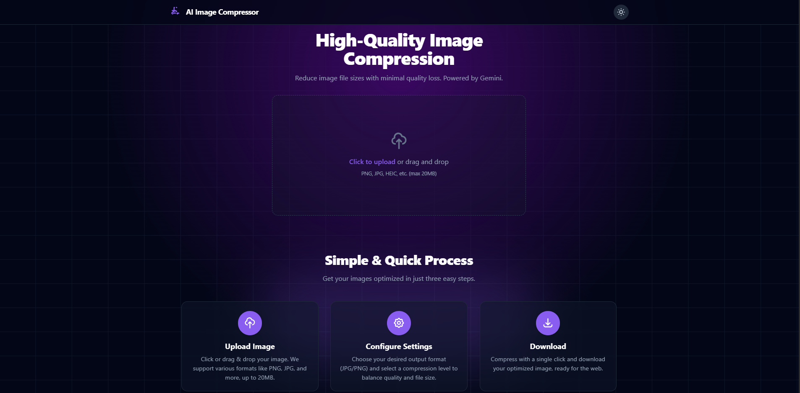

# 🖼️ AI Image Compressor

A modern, AI-powered image compression tool that leverages Google's **Gemini AI** model to intelligently reduce image file sizes while preserving remarkable quality.


---

## ✨ Features

- **🤖 AI-Powered Compression** - Uses Google's Gemini AI model for intelligent, context-aware image compression
- **🔄 Format Conversion** - Convert images between JPG and PNG formats
- **👁️ Live Preview & Comparison** - Instantly compare original and compressed images side-by-side
- **✂️ Image Cropping** - Built-in cropping tool for the perfect finish
- **🌙 Dark/Light Mode** - Sleek theme toggle for comfortable viewing
- **🔒 Privacy First** - Images are processed in memory and never stored on servers
- **📱 Responsive Design** - Works seamlessly on desktop and mobile devices

---

## 🚀 Quick Start

### Prerequisites

- Node.js (v18 or higher)
- npm or yarn
- Gemini API Key

### Installation

1. **Clone the repository**

   ```bash
   git clone https://github.com/rakib8680/Ai-Image-compressor.git
   cd Ai-Image-compressor
   ```

2. **Install dependencies**

   ```bash
   npm install
   ```

3. **Configure API Key**

   The Gemini API key is configured in `index.html`. For production, replace the existing key with your own:

   ```javascript
   window.GEMINI_API_KEY = "YOUR_GEMINI_API_KEY";
   ```

4. **Start development server**

   ```bash
   npm run dev
   ```

5. **Open in browser**
   Navigate to `http://localhost:5173`

---

## 📖 How It Works

1. **Upload Image** - Drag & drop or click to upload your image (supports PNG, JPG, up to 20MB)
2. **Configure Settings** - Choose output format (JPG/PNG) and compression level (Low/Medium/High)
3. **Compress & Download** - Click compress and download your optimized image

---

## 🛠️ Tech Stack

| Technology           | Purpose                  |
| -------------------- | ------------------------ |
| **React 19**         | UI Framework             |
| **TypeScript**       | Type Safety              |
| **Vite**             | Build Tool & Dev Server  |
| **Tailwind CSS**     | Styling                  |
| **Google Gemini AI** | Image Compression Engine |

---

## 📁 Project Structure

```
Ai-Image-compressor/
├── components/          # React components
│   ├── Footer.tsx
│   ├── Icon.tsx
│   ├── ImageDetailModal.tsx
│   ├── ImageUploader.tsx
│   ├── Navbar.tsx
│   ├── ResultDisplay.tsx
│   ├── Spinner.tsx
│   ├── ThemeToggle.tsx
│   └── Tooltip.tsx
├── hooks/               # Custom React hooks
│   └── useTheme.ts
├── services/            # API services
│   └── geminiService.ts
├── utils/               # Utility functions
│   └── fileUtils.ts
├── App.tsx              # Main application component
├── index.tsx            # Entry point
├── types.ts             # TypeScript types
└── index.html           # HTML template
```

---

## 🎨 Screenshot



_Upload your images and configure compression settings with a clean, modern interface._

---

## 📜 Available Scripts

| Command           | Description              |
| ----------------- | ------------------------ |
| `npm run dev`     | Start development server |
| `npm run build`   | Build for production     |
| `npm run preview` | Preview production build |

---

## 🔑 API Configuration

This project uses the **Gemini 2.5 Flash Image** model for compression. The API key is configured in `index.html`:

```javascript
window.GEMINI_API_KEY = "YOUR_API_KEY";
```

> ⚠️ **Note**: For production deployments, use environment variables or a backend service to secure your API key.

---

## 🤝 Contributing

Contributions are welcome! Please feel free to submit a Pull Request.

1. Fork the repository
2. Create your feature branch (`git checkout -b feature/AmazingFeature`)
3. Commit your changes (`git commit -m 'Add some AmazingFeature'`)
4. Push to the branch (`git push origin feature/AmazingFeature`)
5. Open a Pull Request

---

## 📄 License

This project is open source and available under the [MIT License](LICENSE).

---

## 👤 Author

**Rakib**

- GitHub: [@rakib8680](https://github.com/rakib8680)

---

<p align="center">
  Made with ❤️ and powered by <strong>Google Gemini AI</strong>
</p>
